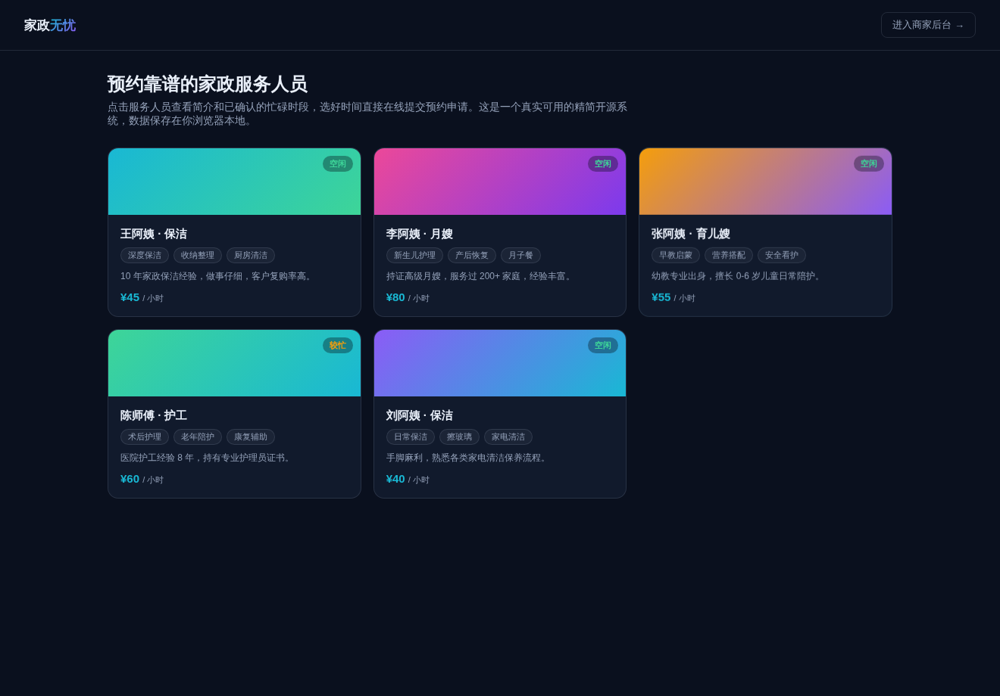

# 家政服务预约系统（精简开源版）· HomeService Lite

**[在线体验（前台）→](https://anna123123123-creator.github.io/homeservice-lite/)** · **[商家后台 →](https://anna123123123-creator.github.io/homeservice-lite/admin.html)**

免费开源的家政服务预约管理系统精简版。这不是截图或原型图，是一个**真实可用**的前后台系统：服务人员浏览、在线预约、忙碌时段查询、防止时间冲突预约，后台人员增删改查、订单确认/取消、数据看板——都是真功能，纯前端 + `localStorage` 实现，不需要服务器、不需要数据库，克隆下来打开就能用，也适合作为学习或二次开发的起点。



## 功能

**前台（客户视角）**
- 服务人员列表浏览（保洁、月嫂、育儿嫂、护工等，含时薪、技能标签、简介、空闲/较忙状态）
- 点开服务人员查看已确认的忙碌时段
- 在线提交预约申请，自动校验：姓名/电话/地址必填、结束时间须晚于开始时间、时间段不能和已确认订单冲突

**后台（商家视角）**
- 仪表盘：服务人员总数、待确认/已确认订单数、本月确认收入（按人员时薪 × 服务时长实时计算）
- 服务人员管理：新增、编辑、删除服务人员
- 订单管理：按状态筛选，确认或取消预约申请

## 试用方法

克隆下来，直接用浏览器打开 `index.html`，或用静态文件服务器跑起来：

```bash
python3 -m http.server 8000
```

前台在 `index.html`，后台在 `admin.html`。所有数据存在浏览器的 `localStorage` 里（`homeservice_lite_data_v1` 这个 key），后台侧边栏有"重置示例数据"按钮可以随时清空重来。

## 技术说明

没有用任何框架或构建工具，纯原生 HTML/CSS/JavaScript，一共 4 个文件：`data.js`（数据层，负责 localStorage 读写和种子数据）、`index.html` + `script.js`（前台）、`admin.html` + `admin.js`（后台）。因为是纯前端 Demo，数据只存在当前浏览器里，不同设备/浏览器之间不会同步——真实生产系统需要一个后端 API 和数据库来替换 `data.js` 里的存储层，其余的界面和交互逻辑基本可以直接复用。

## 协议

MIT，随便怎么用都行。

## 需要定制版？

这个工具免费开源、可以直接用。如果你需要的是**改造成适合自己业务的版本**——换品牌、改字段、加功能、接后端或数据库——我可以做。

- **交付周期**：3–10 个工作日
- **交付内容**：完整源码（不加密、可自行二次开发）+ 在线地址 + 部署说明
- **已有 49 套现成系统**可直接改造，覆盖电商、教育、门店、内容、跨境等行业：[全部清单与在线演示](https://inzyxuashop.com)

把你的需求发给我，24 小时内回复可行性与报价：**evcdecd@gmail.com**
